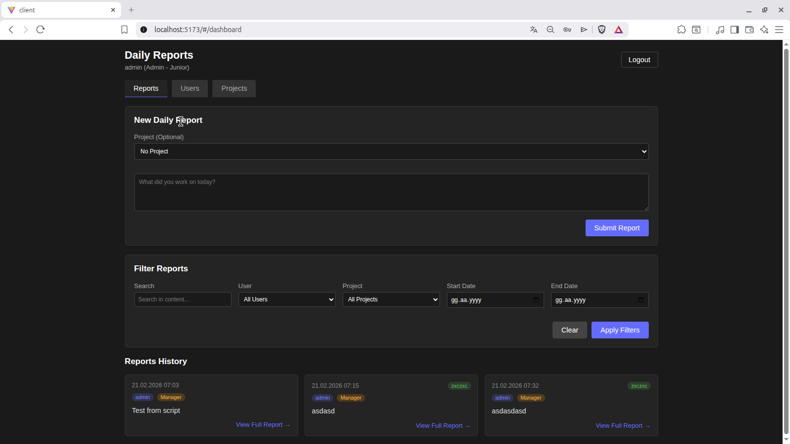
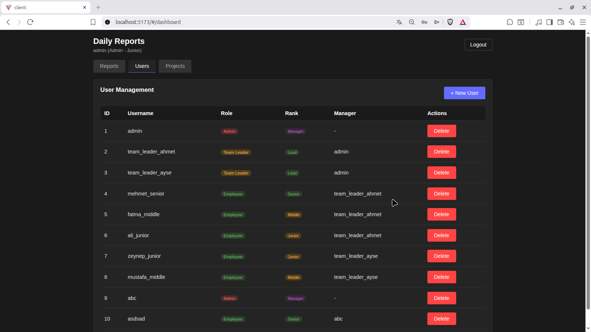
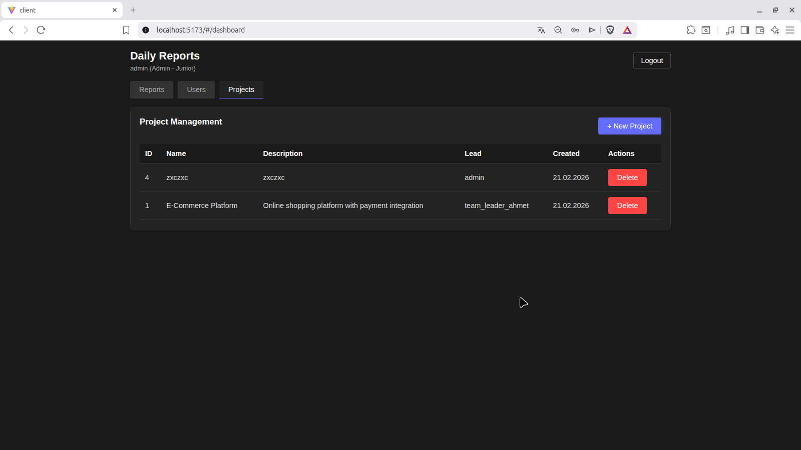

# Daily Report
Bu depo için iki dilli (Türkçe ve English) kullanım kılavuzları bulunmaktadır. Aşağıdan tercih ettiğiniz dilin README dosyasına ulaşabilirsiniz.

# Görüntüler /Screenshots







## Türkçe

Bu proje, yazılımcıların günlük raporlarını tutabilmeleri için hazırlanmış bir örnek uygulamadır. Backend NestJS ile, frontend Svelte ile geliştirilmiştir.

Özellikler
- Kullanıcı kimlik doğrulama (JWT)
- Günlük (daily) rapor oluşturma ve listeleme
- Proje ve kullanıcı yönetimi

Gereksinimler
- Node.js 18+ (yerel geliştirme)
- Docker & Docker Compose (isteğe bağlı, hızlı çalıştırma)

### Kurulum (yerel)
1. Depoyu klonlayın ve dizine girin:
```
git clone <repo-url>
cd daily_report
```
2. Backend için:
```
cd backend
npm install
npm run build
npm run start:dev
```
3. Frontend için (ayrı bir terminalde):
```
cd frontend
npm install
npm run dev
```

### Docker ile çalıştırma
```
docker-compose up --build
```

Veritabanı seed (örnek veriler)
Backend içindeki `seed.ts` dosyasını kullanarak başlangıç verileri ekleyebilirsiniz.

### Testler
```
cd backend
npm run test
```

Katkıda bulunma
- Değişiklik yapmak isterseniz fork -> branch -> pull request şeklinde ilerleyin.

### Örnek kullanıcılar

admin
password123


## English

This project is an example application for developers to keep daily reports. The backend is built with NestJS and the frontend uses Svelte.

Features
- User authentication (JWT)
- Create and list daily reports
- Project and user management

Requirements
- Node.js 18+ (for local development)
- Docker & Docker Compose (optional, quick start)

### Local setup
1. Clone the repository and enter the directory:
```
git clone <repo-url>
cd daily_report
```
2. Backend:
```
cd backend
npm install
npm run build
npm run start:dev
```
3. Frontend (in a separate terminal):
```
cd frontend
npm install
npm run dev
```

### Run with Docker
```
docker-compose up --build
```

Database seed (sample data)
You can use the `seed.ts` file inside the backend to populate initial data.

Tests
```
cd backend
npm run test
```

Contributing
- Please follow fork -> branch -> pull request workflow for contributions.

### example admin user

admin
password123
